<table width="100%">
<tr>
<td align="center" bgcolor="#111827">

  

# Keith Ciceron

### Software Developer

Full-Stack Development · System Design · UI/UX

Building modern web applications with clean interfaces,
reliable systems, and practical user experiences.

 

&nbsp;

&nbsp;

  

</td>
</tr>
</table>

 

`React` · `Next.js` · `TypeScript` · `Node.js` · `PHP` · `Java` · `MySQL` · `Supabase`

---

## About

I'm a software developer from the Philippines focused on building
**complete digital products** — from responsive interfaces and UI/UX
to backend systems, APIs, databases, and deployment.

I enjoy turning ideas into applications that are:

**Clean** · **Functional** · **Scalable** · **Easy to use**

 

| Frontend | Backend | Database | UI/UX |
|:---:|:---:|:---:|:---:|
| Responsive Interfaces | APIs & Business Logic | Data Modeling | Wireframes |
| Component Systems | Authentication | MySQL / Supabase | Prototypes |
| Modern Web Apps | System Architecture | Application Data | User Experience |

---

## Technology

### Frontend

  

### Backend & Database

  

### Tools & Design

---

## Selected Work

<table width="100%">
<tr>

<td width="50%" valign="top">

### NCLEX Amplified

Intern management and review center portal with learning resources,
intern tools, and administrative monitoring.

`React` `TypeScript` `Tailwind` `Node.js`

 

<a href="https://interns.nclexamplifiedreviewcenter.com">
View Project →
</a>

</td>

<td width="50%" valign="top">

### ONE CAINTA

Unified municipal portal and public service application for
Cainta, Rizal.

`PHP` `JavaScript` `MySQL` `PWA`

 

<a href="https://onecainta.com">
View Project →
</a>

</td>

</tr>

<tr>

<td width="50%" valign="top">

### SSCRMNL IT Department

Student-led computing community platform for technical learning,
leadership, and professional connection.

`React` `Vite` `Tailwind` `Supabase`

 

<a href="https://jpcs-sscrmnl.vercel.app/">
View Project →
</a>

</td>

<td width="50%" valign="top">

### Cicerra Realty

Real estate platform for property discovery, detailed listings,
and client inquiries.

`Next.js` `React` `TypeScript` `Tailwind`

 

<a href="https://cicerra-realty-services.vercel.app/">
View Project →
</a>

</td>

</tr>

<tr>

<td width="50%" valign="top">

### SSCRecoletos Connect

Monitoring and evaluation platform with custom surveys,
forms, and visual dashboards.

`React` `TypeScript` `Shadcn UI` `Supabase`

 

School Project

</td>

<td width="50%" valign="top">

### Library Management System

Web-based library system with authentication, book loans,
and librarian management.

`Java` `PHP` `MySQL` `Node.js`

 

School Project

</td>

</tr>
</table>

 

<a href="https://keithciceron.vercel.app">
<strong>View Full Portfolio →</strong>
</a>

---

## GitHub

<table width="100%">
<tr>

<td width="50%" align="center">

</td>

<td width="50%" align="center">

</td>

</tr>
</table>

 

<a href="https://github.com/ciceronkeith4-code">
View GitHub Profile →
</a>

---

## Contribution Activity

---

## Connect

&nbsp;

&nbsp;

&nbsp;

  

Thanks for visiting.

Designed & built by Keith Ciceron

